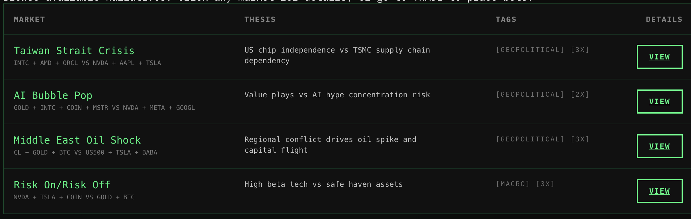

# WAR.MARKET

Trade narratives. Not tickers.



Built for the **Hyperliquid London Community Hackathon** (Jan 16–18, 2026).

Live: `https://www.war.market`

## What this is

WAR.MARKET is a war-room terminal for trading global stress.

You don’t pick one coin and pray.
You pick a story and trade it as a leveraged long/short basket.

Execution runs through **Pear Protocol**.
Settlement happens on **Hyperliquid**.

## What you can do

- Browse narrative markets (intel only)
- Authenticate with Pear (EIP‑712)
- Create a non‑custodial agent wallet
- Place a trade (BET UP / BET DOWN)
- Track P&L and cash out

## Site map

- `/` — splash / landing
- `/markets` — browse-only market list
- `/markets/[id]` — market dossier (browse-only)
- `/trade` — the trading terminal (auth + execution)
- `/portfolio` — positions + P&L

## 60‑second demo flow

1. Go to `/markets` and click a market.
2. Read the dossier. Pick a narrative.
3. Go to `/trade`.
4. Connect wallet.
5. Click **AUTHENTICATE WITH PEAR** and sign.
6. Place a small bet.
7. Go to `/portfolio`. Watch it move. Cash out.

## Local run

Requirements:

- Node.js 18+
- A wallet (MetaMask / Rabby / Coinbase Wallet)

Run:

```bash
git clone https://github.com/b1rdmania/WarGames.git
cd WarGames
npm install

# env
cp .env.example .env.local || true

npm run dev
```

Open `http://localhost:3000`.

## Env vars

```env
# Pear hackathon client id
NEXT_PUBLIC_PEAR_CLIENT_ID=HLHackathon1

# mainnet | testnet
NEXT_PUBLIC_NETWORK=mainnet
```

## Tech

- Next.js (App Router) + TypeScript
- wagmi + viem
- Pear Execution API (auth, agent wallets, positions)
- Hyperliquid settlement (via Pear)

## Notes (read this)

- This is a hackathon build. It is not audited. Use small size.
- iOS is gated to `/ios`. This UI is built for laptop/desktop.
- Markets pages are browse-only on purpose. Trading happens on `/trade`.

## Hackathon track + deck

- Track: **Pear Execution API**
- Deck: `https://www.war.market/deck`
- Docs: `./docs/README.md` (working notes archived)

## Credits

Made by [@b1rdmania](https://x.com/b1rdmania).

Music made in [`wario.style`](https://wario.style).

Repo: `https://github.com/b1rdmania/WarGames`
